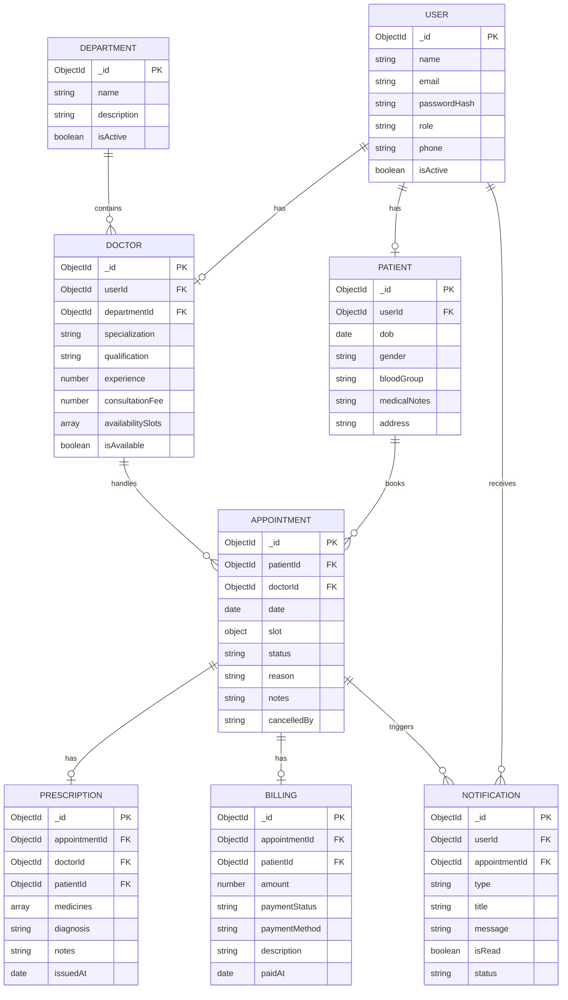

# Hospital Patient & Appointment Management System

A full-stack hospital patient and appointment management system built with Node.js, Express.js, MongoDB, and Mongoose. It provides patient registration, doctor management, appointment scheduling, availability management, digital prescriptions, medical history, billing, notifications, doctor search, reporting, and role-based access control.

---

## Quick Start

```bash
# 1. Clone the repository
git clone https://github.com/jessesuniljs1-collab/Hospital-Patient-And-Appointment-Management-System-L-and-T-Group-Project.git
cd Hospital-Patient-And-Appointment-Management-System-L-and-T-Group-Project

# 2. Install dependencies
npm install

# 3. Configure environment
# On Windows (cmd): copy .env.example .env
# On Windows (PowerShell): Copy-Item .env.example .env
# On macOS / Linux: cp .env.example .env

# 4. Seed demonstration accounts and data
npm run seed

# 5. Start the application
npm start
```

Once running, access:
- **Web Application:** [http://localhost:5000/](http://localhost:5000/)
- **API Base:** [http://localhost:5000/api](http://localhost:5000/api)
- **Health Check:** [http://localhost:5000/api/health](http://localhost:5000/api/health)

---

## Project Overview

Modern healthcare facilities require coordinated scheduling to prevent overlapping doctor bookings, track patient visits, manage medical notes, and streamline administrative reporting. 

This application provides an integrated solution connecting three key user groups:
- **Patients** register, find specialists by department or specialization, view weekly availability, and book appointments without scheduling conflicts.
- **Doctors** maintain weekly working hours, confirm booked appointments, mark visits as completed, issue digital prescriptions, and review relevant patient medical notes.
- **Administrators** manage hospital departments and doctor profiles, track consultation billing statuses, and generate operational reports on appointment volumes, department workloads, and doctor utilization.

The backend is built as a RESTful API powered by Express.js and Mongoose, enforcing schema validation, role-based authorization, and business rules at every layer. The frontend delivers a responsive single-page web interface with real-time feedback, status tracking, and quick-login demonstration tools.

---

## Features

- **Patient Registration & Authentication:** Secure account creation with bcrypt password hashing and JSON Web Token (JWT) sessions.
- **Doctor & Department Management:** Structured medical departments and doctor profiles with qualifications, experience, and consultation fees.
- **Weekly Doctor Availability:** Day-of-week working slots configured per doctor, preventing internal slot overlap.
- **Conflict-Free Appointment Booking:** Real-time overlap detection preventing double-booking for the same doctor at the same date and time.
- **Controlled Status Lifecycle:** Strict status transitions (`Booked` → `Confirmed` → `Completed` / `Cancelled` / `No-show`) with role permission checks.
- **Digital Prescriptions:** Structured medication lists, dosage, frequency, and diagnosis issued exclusively for completed appointments.
- **Patient Medical History:** Protected chronological visit history, prescriptions, and notes accessible only by the owning patient, attending doctor, or administrator.
- **Department & Specialist Directory:** Publicly browsable department listings and doctor profiles with specialization search.
- **In-App Notifications & Reminders:** Event-driven notification records generated on booking, confirmation, completion, cancellation, and prescription issuance.
- **Consultation Billing:** Automatic billing record generation upon visit completion, supporting payment status updates.
- **Administrative Aggregation Reports:** MongoDB aggregation pipelines summarizing appointment metrics, department distribution, and doctor utilization.
- **Role-Based Access Control (RBAC):** Granular endpoint protection ensuring users only access permitted operations and data.
- **Interactive Browser Interface:** Clean, responsive frontend for all roles with quick demo switching and real-time updates.
- **Automated Integration Tests:** Comprehensive test suite with 40 integration tests covering authentication, scheduling conflicts, status transitions, ownership, and reports.
- **Postman API Collection:** Ready-to-import Postman collection covering all resources and workflows.

---

## User Roles

| Role | Permissions & Capabilities |
| :--- | :--- |
| **Patient** | • Register personal account and manage demographic profile<br>• Browse hospital departments and search specialists<br>• Check doctor availability and book non-conflicting appointments<br>• View personal appointments and cancel upcoming bookings<br>• Access personal prescriptions and chronological medical history<br>• View billing records and personal notification feed |
| **Doctor** | • Manage weekly availability slots (day of week, start and end times)<br>• View assigned patient appointments<br>• Update appointment status (`Confirmed`, `Completed`, `Cancelled`, `No-show`)<br>• Issue digital prescriptions for completed visits<br>• View clinical notes and medical history for assigned patients |
| **Admin** | • Create and manage hospital departments<br>• Create, update, and manage doctor profiles<br>• View all system appointments across doctors and departments<br>• Update consultation billing payment statuses (`Pending` → `Paid`)<br>• Generate hospital analytics reports (daily/weekly appointments, department load, doctor utilization) |

---

## Requirements

- **Node.js:** v18.0.0 or higher
- **npm:** v9.0.0 or higher
- **MongoDB:** v5.0+ local / cloud instance (or the built-in development fallback)
- **Git:** v2.30+

---

## Installation

1. **Clone the repository:**
   ```bash
   git clone https://github.com/jessesuniljs1-collab/Hospital-Patient-And-Appointment-Management-System-L-and-T-Group-Project.git
   cd Hospital-Patient-And-Appointment-Management-System-L-and-T-Group-Project
   ```

2. **Install project dependencies:**
   ```bash
   npm install
   ```

3. **Configure environment variables:**
   Copy `.env.example` to create your local `.env` file:
   ```bash
   # Windows Command Prompt
   copy .env.example .env

   # Windows PowerShell
   Copy-Item .env.example .env

   # macOS / Linux
   cp .env.example .env
   ```

---

## Environment Variables

Configure your local `.env` file with the following parameters:

| Variable | Default Value | Description |
| :--- | :--- | :--- |
| `PORT` | `5000` | Port number on which the Express server listens |
| `MONGO_URI` | `mongodb://localhost:27017/hospital_management` | MongoDB connection URI |
| `JWT_SECRET` | `your_jwt_secret_key_change_in_production` | Secret key used to sign and verify JWT tokens |
| `JWT_EXPIRES_IN` | `1d` | Expiration lifespan of issued JWT authentication tokens |
| `NODE_ENV` | `development` | Runtime environment mode (`development` or `production`) |

---

## Database Setup

The application connects to MongoDB using `MONGO_URI` configured in `.env`.

### Standard Setup
Ensure a MongoDB instance is running locally on port 27017 or provide a MongoDB Atlas connection string in your `.env` file:
```env
MONGO_URI=mongodb://localhost:27017/hospital_management
```

### Development Fallback
In development mode (`NODE_ENV=development`), if no running MongoDB server is detected on the configured URI, `config/db.js` automatically starts an embedded, in-memory MongoDB engine (`mongodb-memory-server`). This allows local testing and exploration without requiring a pre-installed database server.

---

## Seed Data

Populate the database with demo departments, doctors with weekly availability, patient records, appointments across multiple statuses, prescriptions, billing records, and notifications:

```bash
npm run seed
```

### Demonstration Accounts

| Role | Email | Password | Details |
| :--- | :--- | :--- | :--- |
| **Admin** | `admin@hospital.com` | `Admin@123` | System Administrator |
| **Doctor** | `dr.sharma@hospital.com` | `Doctor@123` | Dr. Rajesh Sharma (Cardiology) |
| **Doctor** | `dr.patel@hospital.com` | `Doctor@123` | Dr. Priya Patel (Neurology) |
| **Patient** | `patient1@example.com` | `Patient@123` | John Doe (Blood Group O+) |
| **Patient** | `patient2@example.com` | `Patient@123` | Sarah Smith (Blood Group B+) |

---

## Running the Application

### Start Production Server
```bash
npm start
```

### Start Development Server (with Auto-Reload)
```bash
npm run dev
```

### Run Integration Tests
```bash
npm test
```

### Run Live API Verification
With the server running on port 5000:
```bash
npm run verify
```

---

## Demo

Follow this walkthrough to experience the complete clinical and administrative workflow:

```
Sign In (Patient) ──► Search Specialist ──► Book Appointment
                                                  │
                                                  ▼
View Reports ◄── Update Billing ◄── Issue Prescription ◄── Confirm & Complete
   (Admin)          (Admin)             (Doctor)              (Doctor)
```

1. **Launch the Application:** Run `npm start` and open [http://localhost:5000/](http://localhost:5000/) in your browser.
2. **Search Doctors:** Click on **Doctors** to browse specialists or filter by specialization (e.g., *Cardiology*).
3. **Sign In as Patient:** Use the **Quick Demo Login** banner and select `🧑 John Doe (Patient 1)`.
4. **Book an Appointment:** Select an available doctor, pick a date, choose an available time slot, and confirm booking.
5. **Switch to Doctor:** Click `🩺 Dr. Sharma (Cardio)`. Navigate to **Doctor Desk** to see the new booking.
6. **Confirm & Complete Visit:** Update status to `Confirmed`, then transition to `Completed`.
7. **Issue Digital Prescription:** Fill in diagnosis, medications, dosage, frequency, and submit.
8. **Review History & Billing:** Switch back to Patient or open **Medical History** to view the generated prescription, visit record, and pending consultation fee.
9. **Administrative Oversight:** Click `🔑 Admin` and open **Admin & Reports** to inspect live appointment charts, department workload, and update the billing payment status to `Paid`.

---

## API Documentation

All protected endpoints require a valid JWT token passed in the `Authorization` header:
`Authorization: Bearer <token>`

### Authentication (`/api/auth`)

| Method | Endpoint | Access | Description |
| :--- | :--- | :--- | :--- |
| `POST` | `/api/auth/register` | Public | Register a new patient account |
| `POST` | `/api/auth/login` | Public | Authenticate user and receive JWT token |
| `GET` | `/api/auth/me` | Authenticated | Retrieve authenticated user details |

### Departments (`/api/departments`)

| Method | Endpoint | Access | Description |
| :--- | :--- | :--- | :--- |
| `GET` | `/api/departments` | Public | List all active hospital departments |
| `GET` | `/api/departments/:id` | Public | Get single department by ID |
| `POST` | `/api/departments` | Admin | Create a new department |
| `PUT` | `/api/departments/:id` | Admin | Update department details |
| `DELETE` | `/api/departments/:id` | Admin | Deactivate or delete department |

### Doctors (`/api/doctors`)

| Method | Endpoint | Access | Description |
| :--- | :--- | :--- | :--- |
| `GET` | `/api/doctors` | Public | List and search doctors by specialization or department |
| `GET` | `/api/doctors/:id` | Public | Get doctor profile and weekly availability |
| `POST` | `/api/doctors` | Admin | Register a new doctor profile |
| `PUT` | `/api/doctors/:id` | Admin / Doctor | Update doctor details |
| `PUT` | `/api/doctors/:id/availability` | Admin / Doctor | Update doctor weekly availability schedule |
| `DELETE` | `/api/doctors/:id` | Admin | Remove doctor profile |

### Appointments (`/api/appointments`)

| Method | Endpoint | Access | Description |
| :--- | :--- | :--- | :--- |
| `POST` | `/api/appointments` | Patient / Admin | Book a new appointment with conflict detection |
| `GET` | `/api/appointments` | Authenticated | List appointments (filtered by user role) |
| `GET` | `/api/appointments/:id` | Authenticated | Get appointment details by ID |
| `PATCH` | `/api/appointments/:id/status` | Authenticated | Update appointment status with transition validation |

### Prescriptions (`/api/prescriptions`)

| Method | Endpoint | Access | Description |
| :--- | :--- | :--- | :--- |
| `POST` | `/api/prescriptions` | Doctor | Issue prescription for a completed appointment |
| `GET` | `/api/prescriptions/:id` | Authenticated | Get prescription details by ID |
| `GET` | `/api/prescriptions/appointment/:appointmentId` | Authenticated | Get prescription for a specific appointment |
| `GET` | `/api/prescriptions/patient/:patientId` | Authenticated | Get all prescriptions for a patient (ownership protected) |

### Patients & Medical History (`/api/patients`)

| Method | Endpoint | Access | Description |
| :--- | :--- | :--- | :--- |
| `GET` | `/api/patients/me` | Patient | Get authenticated patient profile |
| `PUT` | `/api/patients/me/profile` | Patient | Update personal medical profile details |
| `GET` | `/api/patients/:id/history` | Authenticated | Get chronological medical history (ownership protected) |
| `GET` | `/api/patients` | Admin / Doctor | List registered patients |

### Billing (`/api/billing`)

| Method | Endpoint | Access | Description |
| :--- | :--- | :--- | :--- |
| `GET` | `/api/billing/:id` | Authenticated | Get billing invoice details |
| `GET` | `/api/billing/patient/:patientId` | Authenticated | Get all invoices for a patient |
| `POST` | `/api/billing` | Admin | Manually generate billing record |
| `PATCH` | `/api/billing/:id` | Admin | Update billing payment status and method |

### Notifications (`/api/notifications`)

| Method | Endpoint | Access | Description |
| :--- | :--- | :--- | :--- |
| `GET` | `/api/notifications` | Authenticated | Get user notifications and unread count |
| `PATCH` | `/api/notifications/:id/read` | Authenticated | Mark single notification as read |
| `PATCH` | `/api/notifications/read-all` | Authenticated | Mark all user notifications as read |

### Administrative Reports (`/api/admin/reports`)

| Method | Endpoint | Access | Description |
| :--- | :--- | :--- | :--- |
| `GET` | `/api/admin/reports/appointments` | Admin | Aggregated appointment statistics by period |
| `GET` | `/api/admin/reports/department-load` | Admin | Department patient volume and workload distribution |
| `GET` | `/api/admin/reports/doctor-utilization` | Admin | Doctor booking volume and completion rate metrics |

### System Health (`/api/health`)

| Method | Endpoint | Access | Description |
| :--- | :--- | :--- | :--- |
| `GET` | `/api/health` | Public | System status, environment, and uptime timestamp |

---

## Business Rules

1. **Appointment Conflict Detection:** A doctor cannot have two active appointments (`Booked` or `Confirmed`) that overlap on the same date and time. Any booking attempt with conflicting times returns HTTP `409 APPOINTMENT_CONFLICT`.
2. **Availability Schedule Validation:** A doctor's weekly availability slots cannot overlap with another slot on the same weekday. Slot start times must strictly precede end times.
3. **Controlled Status Workflow:** Appointments adhere to an enforced state machine:
   - `Booked` → `Confirmed` or `Cancelled`
   - `Confirmed` → `Completed`, `Cancelled`, or `No-show`
   - `Completed`, `Cancelled`, and `No-show` are terminal states; no further transitions are allowed.
4. **Prescription Eligibility:** Digital prescriptions can only be created for appointments that have reached the `Completed` status. Only the attending doctor may issue the prescription, and an appointment can have at most one prescription.
5. **Medical History Protection:** Patient medical records are strictly protected. A patient can only retrieve their own history. Cross-patient data access attempts return HTTP `403 OWNERSHIP_VIOLATION`.
6. **Automated Consultation Billing:** When an appointment transitions to `Completed`, the system automatically generates a consultation billing invoice with status `Pending`, matching the doctor's set fee.
7. **Role-Based Access Control:** Middleware validates JWT tokens and ensures users have the necessary privileges (`Patient`, `Doctor`, or `Admin`) before executing protected routes.

---

## Database Collections & Relationships

The MongoDB database is organized into 8 collections. Weekly doctor availability slots are embedded directly inside the `doctors` collection.



### Collections Reference

- **`users`:** Core user credentials, roles (`Patient`, `Doctor`, `Admin`), contact details, and account status.
- **`patients`:** Patient demographics, date of birth, blood group, medical notes, address, and emergency contact information.
- **`doctors`:** Doctor credentials linked to `users` and `departments`, qualifications, experience, consultation fee, and embedded weekly availability schedules.
- **`departments`:** Hospital departments (Cardiology, Neurology, Orthopedics, Pediatrics, General Medicine).
- **`appointments`:** Visit records linking patients and doctors with dates, time slots, status (`Booked`, `Confirmed`, `Completed`, `Cancelled`, `No-show`), and clinical notes.
- **`prescriptions`:** Clinical prescriptions linked to completed appointments, containing structured medication items, diagnosis, and physician notes.
- **`billing`:** Consultation invoices linked to appointments, recording fee amounts, payment methods, and statuses (`Pending`, `Paid`, `Cancelled`).
- **`notifications`:** User-facing notifications for booking confirmations, reminders, status updates, and prescription issuances.

---

## Project Structure

```
Hospital-Patient-And-Appointment-Management-System-L-and-T-Group-Project/
├── config/
│   ├── db.js                     # MongoDB connection & embedded memory-server fallback
│   └── env.js                    # Environment variable configuration
├── controllers/
│   ├── appointmentController.js  # Booking engine, conflict detection, workflow
│   ├── authController.js         # Register, Login, Current User
│   ├── billingController.js      # Invoicing & payment updates
│   ├── departmentController.js   # Department CRUD operations
│   ├── doctorController.js       # Doctor profiles, search, availability slots
│   ├── notificationController.js # Notification retrieval & read markers
│   ├── patientController.js      # Patient profile & chronological medical history
│   ├── prescriptionController.js # Prescription generation & retrieval
│   └── reportController.js       # MongoDB aggregation reports
├── middleware/
│   ├── auth.js                   # JWT token authentication
│   ├── authorize.js              # Role-based & ownership authorization
│   ├── errorHandler.js           # Centralized API error handling
│   └── validate.js               # express-validator request validation
├── models/
│   ├── Appointment.js            # Appointment schema & indexes
│   ├── Billing.js                # Consultation billing schema
│   ├── Department.js             # Hospital department schema
│   ├── Doctor.js                 # Doctor schema & embedded availability
│   ├── Notification.js           # Notification schema
│   ├── Patient.js                # Patient profile schema
│   ├── Prescription.js           # Prescription schema
│   └── User.js                   # User account schema & bcrypt hashing
├── postman/
│   └── P02-Hospital-System.postman_collection.json # Exported Postman collection
├── public/
│   ├── app.js                    # Frontend dynamic application logic
│   ├── index.html                # Responsive web interface
│   └── style.css                 # Application styling
├── routes/
│   ├── appointmentRoutes.js      # Appointment endpoints
│   ├── authRoutes.js             # Auth endpoints
│   ├── billingRoutes.js          # Billing endpoints
│   ├── departmentRoutes.js       # Department endpoints
│   ├── doctorRoutes.js           # Doctor endpoints
│   ├── notificationRoutes.js     # Notification endpoints
│   ├── patientRoutes.js          # Patient endpoints
│   ├── prescriptionRoutes.js     # Prescription endpoints
│   └── reportRoutes.js           # Administrative reporting endpoints
├── scripts/
│   └── verify-api.js             # Live end-to-end API verification script
├── seed/
│   ├── seed.js                   # Standalone seed runner
│   └── seedHelper.js             # Demo data generator
├── services/
│   └── notificationService.js    # In-app event notification dispatcher
├── tests/
│   └── api.test.js               # 40 automated Jest integration tests
├── validators/
│   ├── appointmentValidator.js   # Booking & slot validation rules
│   ├── authValidator.js          # Registration & login validation
│   ├── billingValidator.js       # Payment validation rules
│   ├── departmentValidator.js    # Department validation rules
│   ├── doctorValidator.js        # Doctor & availability rules
│   ├── patientValidator.js       # Patient profile validation
│   └── prescriptionValidator.js   # Prescription structure validation
├── .env.example                  # Template environment variables
├── .gitignore                    # Git exclusion rules
├── package.json                  # Dependencies and execution scripts
├── package-lock.json             # Locked dependency tree
├── README.md                     # Project documentation
└── server.js                     # Express application entrypoint
```

---

## Testing

### Automated Test Suite
The automated test suite uses Jest and Supertest to execute 40 unit and integration tests covering all major application flows:

```bash
npm test
```

Test coverage includes:
- User registration, duplicate email handling, and input validation
- Login verification, invalid password rejection, and missing token handling
- Department creation permissions and public directory access
- Doctor profile creation, availability updates, and slot overlap prevention
- Appointment booking with conflict rejection on overlapping slots
- Status workflow state transitions (`Booked` → `Confirmed` → `Completed`)
- Invalid status transition rejections
- Prescription generation restrictions (Doctor only, Completed appointments only)
- Patient medical history ownership protection (`403 OWNERSHIP_VIOLATION`)
- Automatic billing generation and payment updates
- In-app notification creation and mark-as-read functionality
- Administrative aggregation reports and non-admin access restrictions

### Live API Verification
To execute live end-to-end API verification tests against a running server:

```bash
# 1. Start the server
npm start

# 2. In another terminal, run verification
npm run verify
```

---

## Postman Collection

A complete Postman collection is provided in the repository:
`postman/P02-Hospital-System.postman_collection.json`

### Usage:
1. Start the application (`npm start`).
2. Open **Postman** and click **Import**.
3. Select `postman/P02-Hospital-System.postman_collection.json`.
4. The collection includes pre-configured environment variables (`baseUrl = http://localhost:5000/api`).
5. Run requests sequentially or execute the collection runner.

---

## Troubleshooting

| Problem | Cause | Solution |
| :--- | :--- | :--- |
| `MongoDB Connection Error` | Local MongoDB daemon is not running | Start local MongoDB service (`mongod`), verify `MONGO_URI` in `.env`, or allow the built-in development fallback to initialize in development mode. |
| `Port 5000 already in use` | Another process is occupying port 5000 | Change `PORT` in `.env` (e.g., `PORT=5001`) or terminate the conflicting process. |
| `401 Unauthorized` | Missing, expired, or invalid JWT token | Log in via `/api/auth/login` to obtain a fresh token and pass it in the `Authorization: Bearer <token>` header. |
| `403 Forbidden` / `OWNERSHIP_VIOLATION` | Insufficient role permissions or accessing another user's records | Verify your user role matches the required operation (`Admin`, `Doctor`, or `Patient`) or check record ownership. |
| `409 APPOINTMENT_CONFLICT` | Overlapping appointment for the selected doctor | Choose a different time slot or date when the doctor has no active bookings. |
| `409 OVERLAPPING_SLOTS` | Doctor availability slots overlap on the same day | Ensure availability slot start and end times do not intersect on the same day. |
| Empty database records | Database has not been seeded | Run `npm run seed` to generate demonstration data. |

---

## Security

- **Password Hashing:** Passwords are salted and hashed using `bcryptjs` (salt rounds: 12) before persistence.
- **JWT Authorization:** Stateless authentication using cryptographically signed JSON Web Tokens with configurable expiration.
- **Role-Based Access Control:** Strict route authorization ensuring users access only endpoints permitted for their role.
- **Ownership Protection:** Patient medical records, history, and prescriptions are protected by user ID matching checks.
- **Input Validation:** Request sanitization and validation using `express-validator` across all write operations.
- **Environment Isolation:** Secrets and configuration are loaded exclusively via environment variables; `.env` is excluded from source control.

---

## Contributions

This project was developed collaboratively across four main areas:
- **Core Setup & Scheduling:** Patient authentication, doctor and department management, doctor availability schedules, and appointment booking.
- **Clinical Workflow:** Appointment status workflow management, digital prescriptions, patient medical history, and department directory.
- **Supporting Services & Reporting:** In-app notifications, consultation billing, doctor search, administrative reports, and role-based access control.
- **Integration & Documentation:** Database schema design, API testing, Postman collection, documentation, and system integration.

---

## License

This project is licensed under the [ISC License](package.json).
