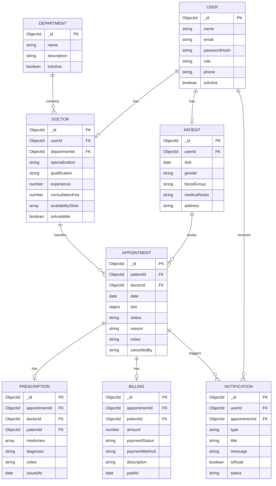

# Hospital Patient & Appointment Management System

A full-stack hospital patient and appointment management system built with Node.js, Express.js, MongoDB, and Mongoose. It provides patient registration, doctor management, appointment scheduling, availability management, digital prescriptions, medical history, billing, notifications, doctor search, reporting, and role-based access control.

---

## Features

- **Patient Registration & Authentication:** Secure patient registration and login using bcrypt password hashing and JSON Web Tokens (JWT).
- **Doctor & Department Management:** Hospital departments and doctor profiles with qualifications, experience, and consultation fees.
- **Weekly Doctor Availability:** Day-of-week working hours per doctor, with internal validation preventing overlapping slots on the same day.
- **Conflict-Free Appointment Booking:** Booking engine with real-time overlap detection preventing double bookings for doctors.
- **Appointment Status Lifecycle:** Controlled status progression (`Booked` → `Confirmed` → `Completed` / `Cancelled` / `No-show`).
- **Digital Prescriptions:** Electronic prescription records linked to completed appointments with medication details, dosage, and diagnosis.
- **Patient Medical History:** Protected chronological history of appointments and prescriptions with user ownership checks.
- **Department & Doctor Directory:** Publicly browsable department listings and doctor search filtered by specialization or department.
- **Notifications & Reminders:** Event-driven in-app notifications generated for bookings, confirmations, cancellations, completions, and prescriptions.
- **Consultation Billing:** Automatic billing record creation upon appointment completion, supporting payment status updates.
- **Administrative Reports:** MongoDB aggregation reports summarizing appointment metrics, department workloads, and doctor utilization.
- **Role-Based Access Control (RBAC):** Middleware-level authorization protecting routes for `Patient`, `Doctor`, and `Admin` roles.
- **Interactive Web Interface:** Single-page frontend with responsive layouts, modal workflows, and demo switching tools.
- **Integration Test Suite:** 40 automated Jest integration tests covering all critical backend services and business rules.
- **Postman API Collection:** Pre-configured collection for testing and verifying all API endpoints.

---

## User Roles

| Role | Permissions & Capabilities |
| :--- | :--- |
| **Patient** | • Create an account and manage profile details<br>• Search doctors by specialization and department<br>• View doctor availability and book appointments without conflicts<br>• View personal appointments and cancel upcoming bookings<br>• View personal prescriptions and medical history<br>• View billing records and notifications |
| **Doctor** | • Manage weekly availability slots (weekday, start time, end time)<br>• View assigned patient appointments<br>• Confirm and complete appointments<br>• Issue digital prescriptions for completed visits<br>• View permitted patient medical details |
| **Admin** | • Manage hospital departments (create, update, delete)<br>• Manage doctor profiles and assignments<br>• View all hospital appointments<br>• Update billing payment statuses (`Pending` → `Paid`)<br>• View administrative analytics reports |

---

## Quick Start

```bash
# Clone the repository
git clone https://github.com/jessesuniljs1-collab/Hospital-Patient-And-Appointment-Management-System-L-and-T-Group-Project.git
cd Hospital-Patient-And-Appointment-Management-System-L-and-T-Group-Project

# Install dependencies
npm install

# Create environment file
# Windows (CMD): copy .env.example .env
# Windows (PowerShell): Copy-Item .env.example .env
# macOS / Linux: cp .env.example .env

# Seed demonstration data
npm run seed

# Start the application
npm start
```

Access points:
- **Frontend Application:** [http://localhost:5000/](http://localhost:5000/)
- **API Base URL:** [http://localhost:5000/api](http://localhost:5000/api)
- **Health Endpoint:** [http://localhost:5000/api/health](http://localhost:5000/api/health)

---

## Requirements

- **Node.js:** v18.0.0 or higher
- **npm:** v9.0.0 or higher
- **MongoDB:** v5.0+ local server, MongoDB Atlas, or the built-in development fallback
- **Git:** v2.30 or higher

---

## Installation

1. Clone the repository:
   ```bash
   git clone https://github.com/jessesuniljs1-collab/Hospital-Patient-And-Appointment-Management-System-L-and-T-Group-Project.git
   cd Hospital-Patient-And-Appointment-Management-System-L-and-T-Group-Project
   ```

2. Install dependencies:
   ```bash
   npm install
   ```

3. Create your `.env` configuration:
   ```bash
   # Windows (CMD)
   copy .env.example .env

   # Windows (PowerShell)
   Copy-Item .env.example .env

   # macOS / Linux
   cp .env.example .env
   ```

---

## Environment Variables

Configure parameters in `.env`:

| Variable | Default Value | Description |
| :--- | :--- | :--- |
| `PORT` | `5000` | Port on which the HTTP server listens |
| `MONGO_URI` | `mongodb://localhost:27017/hospital_management` | MongoDB connection string |
| `JWT_SECRET` | `your_jwt_secret_key_change_in_production` | Secret key for signing JSON Web Tokens |
| `JWT_EXPIRES_IN` | `1d` | Expiration window for issued JWT tokens |
| `NODE_ENV` | `development` | Application environment (`development` or `production`) |

---

## Database Setup

The application uses MongoDB. You can run it with local MongoDB, MongoDB Atlas, or the built-in development fallback.

### Option 1: Local MongoDB (Recommended for Local Development)
Make sure MongoDB is running before starting the application when using local MongoDB.

- **Windows:**
  - If installed as a Windows service:
    ```powershell
    # PowerShell (Run as Administrator)
    Start-Service MongoDB
    # or in Command Prompt:
    net start MongoDB
    ```
  - If running manually via executable:
    ```bash
    mongod
    ```
- **macOS / Linux:**
  - The exact command depends on how MongoDB was installed:
    ```bash
    # macOS (Homebrew)
    brew services start mongodb-community

    # Linux (systemd)
    sudo systemctl start mongod
    ```
- **Verify it is running:**
  MongoDB normally listens on `mongodb://localhost:27017`. You can test connection with `mongosh` (MongoDB Shell):
  ```bash
  mongosh
  ```
  In your `.env`, set:
  ```env
  MONGO_URI=mongodb://localhost:27017/hospital_management
  ```
  This tells the application to connect to the `hospital_management` database on your local server.

### Option 2: MongoDB Atlas (Cloud)
1. Create a free cluster on [MongoDB Atlas](https://www.mongodb.com/atlas).
2. Create a database user with password.
3. Whitelist your current IP address (or `0.0.0.0/0` for development).
4. Copy the connection string and paste it into `.env`:
   ```env
   MONGO_URI=mongodb+srv://<username>:<password>@cluster0.example.mongodb.net/hospital_management?retryWrites=true&w=majority
   ```

### Option 3: Development Fallback
In development mode (`NODE_ENV=development`), if no local MongoDB instance is running on `MONGO_URI`, `config/db.js` automatically starts an embedded, in-memory MongoDB instance (`mongodb-memory-server`). This allows immediate local exploration without installing a database server.

---

## How to Run

Follow this startup sequence:

```
Install Node.js + MongoDB ──► Clone Repository ──► npm install ──► Create .env ──► Start MongoDB ──► npm run seed ──► npm start ──► Open http://localhost:5000/
```

> **Note:** MongoDB and the Node.js application are separate processes. When using local MongoDB, start MongoDB first, then run the commands below in your project folder.

### Step 1 — Clone the repository
```bash
git clone https://github.com/jessesuniljs1-collab/Hospital-Patient-And-Appointment-Management-System-L-and-T-Group-Project.git
cd Hospital-Patient-And-Appointment-Management-System-L-and-T-Group-Project
```

### Step 2 — Install dependencies
```bash
npm install
```

### Step 3 — Create `.env`
```bash
# Windows CMD
copy .env.example .env

# Windows PowerShell
Copy-Item .env.example .env

# macOS / Linux
cp .env.example .env
```

### Step 4 — Start MongoDB
Ensure your MongoDB service is running (see [Database Setup](#database-setup) above) or configure your MongoDB Atlas URI in `.env`.

### Step 5 — Seed the database
```bash
npm run seed
```
This populates demonstration departments, user accounts, doctors, availability schedules, appointments, prescriptions, billing, and notifications.

### Step 6 — Start the application
```bash
# Standard production-style start
npm start

# Or development mode with auto-reload on file changes
npm run dev
```

### Step 7 — Open the application
- **Frontend Interface:** [http://localhost:5000/](http://localhost:5000/)
- **API Base:** [http://localhost:5000/api](http://localhost:5000/api)
- **Health Check:** [http://localhost:5000/api/health](http://localhost:5000/api/health)

---

## Seed Data

```bash
npm run seed
```

### Demonstration Accounts

| Role | Email | Password | Details |
| :--- | :--- | :--- | :--- |
| **Admin** | `admin@hospital.com` | `Admin@123` | System Administrator |
| **Doctor** | `dr.sharma@hospital.com` | `Doctor@123` | Dr. Rajesh Sharma (Cardiology) |
| **Doctor** | `dr.patel@hospital.com` | `Doctor@123` | Dr. Priya Patel (Neurology) |
| **Patient** | `patient1@example.com` | `Patient@123` | John Doe |
| **Patient** | `patient2@example.com` | `Patient@123` | Sarah Smith |

---

## Demo

Follow this workflow in your browser:

1. **Start the server:** Run `npm start` and open [http://localhost:5000/](http://localhost:5000/).
2. **Search doctors:** Browse specialists on the home page or filter by specialization.
3. **Sign in as Patient:** Click `🧑 John Doe (Patient 1)` in the quick demo banner.
4. **Book an appointment:** Choose a doctor, select an available date/time slot, and confirm.
5. **Sign in as Doctor:** Switch to `🩺 Dr. Sharma (Cardio)`, go to **Doctor Desk**, confirm the booking, and mark it `Completed`.
6. **Issue prescription:** In Doctor Desk, enter medication dosage and diagnosis for the completed visit.
7. **View patient history & billing:** Switch back to Patient to review the prescription, updated medical history, and generated consultation invoice.
8. **Admin reports & billing:** Switch to `🔑 Admin` to view aggregation analytics under **Admin & Reports** and mark billing as `Paid`.

---

## API Documentation

Protected routes require: `Authorization: Bearer <token>`

### Authentication (`/api/auth`)
| Method | Endpoint | Access | Description |
| :--- | :--- | :--- | :--- |
| `POST` | `/api/auth/register` | Public | Register new patient account |
| `POST` | `/api/auth/login` | Public | Authenticate user and receive JWT |
| `GET` | `/api/auth/me` | Authenticated | Get current authenticated user |

### Departments (`/api/departments`)
| Method | Endpoint | Access | Description |
| :--- | :--- | :--- | :--- |
| `GET` | `/api/departments` | Public | List active hospital departments |
| `GET` | `/api/departments/:id` | Public | Get department details |
| `POST` | `/api/departments` | Admin | Create hospital department |
| `PUT` | `/api/departments/:id` | Admin | Update department details |
| `DELETE` | `/api/departments/:id` | Admin | Deactivate department |

### Doctors (`/api/doctors`)
| Method | Endpoint | Access | Description |
| :--- | :--- | :--- | :--- |
| `GET` | `/api/doctors` | Public | Search doctors by specialization/department |
| `GET` | `/api/doctors/:id` | Public | Get doctor profile and availability |
| `POST` | `/api/doctors` | Admin | Create doctor profile |
| `PUT` | `/api/doctors/:id` | Admin / Doctor | Update doctor profile |
| `PUT` | `/api/doctors/:id/availability` | Admin / Doctor | Update doctor weekly availability slots |
| `DELETE` | `/api/doctors/:id` | Admin | Remove doctor profile |

### Appointments (`/api/appointments`)
| Method | Endpoint | Access | Description |
| :--- | :--- | :--- | :--- |
| `POST` | `/api/appointments` | Patient / Admin | Book appointment with conflict checking |
| `GET` | `/api/appointments` | Authenticated | List appointments (filtered by user role) |
| `GET` | `/api/appointments/:id` | Authenticated | Get appointment details |
| `PATCH` | `/api/appointments/:id/status` | Authenticated | Update status (`Confirmed`, `Completed`, etc.) |

### Prescriptions (`/api/prescriptions`)
| Method | Endpoint | Access | Description |
| :--- | :--- | :--- | :--- |
| `POST` | `/api/prescriptions` | Doctor | Issue prescription for completed visit |
| `GET` | `/api/prescriptions/:id` | Authenticated | Get prescription by ID |
| `GET` | `/api/prescriptions/appointment/:appointmentId` | Authenticated | Get prescription for an appointment |
| `GET` | `/api/prescriptions/patient/:patientId` | Authenticated | Get all prescriptions for a patient |

### Patients & Medical History (`/api/patients`)
| Method | Endpoint | Access | Description |
| :--- | :--- | :--- | :--- |
| `GET` | `/api/patients/me` | Patient | Get current patient profile |
| `PUT` | `/api/patients/me/profile` | Patient | Update personal medical profile |
| `GET` | `/api/patients/:id/history` | Authenticated | Get medical history (ownership protected) |
| `GET` | `/api/patients` | Admin / Doctor | List registered patients |

### Billing (`/api/billing`)
| Method | Endpoint | Access | Description |
| :--- | :--- | :--- | :--- |
| `GET` | `/api/billing/:id` | Authenticated | Get billing invoice details |
| `GET` | `/api/billing/patient/:patientId` | Authenticated | Get invoices for a patient |
| `POST` | `/api/billing` | Admin | Create billing invoice |
| `PATCH` | `/api/billing/:id` | Admin | Update payment status (`Pending` → `Paid`) |

### Notifications (`/api/notifications`)
| Method | Endpoint | Access | Description |
| :--- | :--- | :--- | :--- |
| `GET` | `/api/notifications` | Authenticated | Get notifications and unread count |
| `PATCH` | `/api/notifications/:id/read` | Authenticated | Mark notification as read |
| `PATCH` | `/api/notifications/read-all` | Authenticated | Mark all notifications as read |

### Administrative Reports (`/api/admin/reports`)
| Method | Endpoint | Access | Description |
| :--- | :--- | :--- | :--- |
| `GET` | `/api/admin/reports/appointments` | Admin | Appointment metrics by period |
| `GET` | `/api/admin/reports/department-load` | Admin | Patient volume across departments |
| `GET` | `/api/admin/reports/doctor-utilization` | Admin | Doctor booking volume and completion rate |

### Health Check (`/api/health`)
| Method | Endpoint | Access | Description |
| :--- | :--- | :--- | :--- |
| `GET` | `/api/health` | Public | Check service status and uptime |

---

## Business Rules

1. **Appointment Conflicts:** A doctor cannot have overlapping active bookings (`Booked` or `Confirmed`) at the same date and time. Conflicting attempts return HTTP `409 APPOINTMENT_CONFLICT`.
2. **Availability Slot Overlaps:** A doctor's availability slots cannot overlap on the same day of the week, and start times must precede end times.
3. **Appointment Status Workflow:** Appointments follow valid state transitions:
   - `Booked` → `Confirmed` or `Cancelled`
   - `Confirmed` → `Completed`, `Cancelled`, or `No-show`
   - Terminal states (`Completed`, `Cancelled`, `No-show`) cannot be modified further.
4. **Prescription Eligibility:** Digital prescriptions can only be created for appointments in `Completed` status. Only the attending doctor may issue the prescription.
5. **Medical History Ownership:** Patients can only access their own medical history. Unauthorized access attempts return HTTP `403 OWNERSHIP_VIOLATION`.
6. **Automated Billing:** Marking an appointment as `Completed` automatically generates a consultation billing invoice with status `Pending`.
7. **Role-Based Protection:** Protected endpoints enforce user role checks (`Patient`, `Doctor`, `Admin`) at the route layer.

---

## Database Collections & Relationships

The system uses 8 Mongoose collections. Doctor weekly availability slots are embedded directly inside the `doctors` collection.



### Collections Summary

- **`users`:** Accounts, hashed credentials, roles (`Patient`, `Doctor`, `Admin`), and contact details.
- **`patients`:** Patient demographics, date of birth, blood group, medical notes, address, and emergency contact.
- **`doctors`:** Doctor profiles, department links, qualifications, fees, and embedded weekly availability slots.
- **`departments`:** Hospital departments (e.g., Cardiology, Neurology, Orthopedics).
- **`appointments`:** Booked visits linking patients and doctors with date, time slot, status, and cancellation notes.
- **`prescriptions`:** Clinical prescriptions for completed appointments with medicine lists, dosages, and diagnosis.
- **`billing`:** Consultation fee invoices linked to appointments with payment statuses (`Pending`, `Paid`, `Cancelled`).
- **`notifications`:** User notification logs for booking confirmations, reminders, and prescription issuances.

---

## Project Structure

```
Hospital-Patient-And-Appointment-Management-System-L-and-T-Group-Project/
├── config/
│   ├── db.js                     # MongoDB connection & embedded fallback
│   └── env.js                    # Environment variable configuration
├── controllers/
│   ├── appointmentController.js  # Booking, conflict checks, status transitions
│   ├── authController.js         # Authentication, registration, current user
│   ├── billingController.js      # Invoicing and payment status updates
│   ├── departmentController.js   # Department management
│   ├── doctorController.js       # Doctor profiles, search, availability slots
│   ├── notificationController.js # Notifications retrieval & read markers
│   ├── patientController.js      # Patient profiles & chronological medical history
│   ├── prescriptionController.js # Prescription generation & retrieval
│   └── reportController.js       # Administrative aggregation reports
├── middleware/
│   ├── auth.js                   # JWT token authentication
│   ├── authorize.js              # Role-based & ownership authorization
│   ├── errorHandler.js           # Centralized API error handling
│   └── validate.js               # express-validator request validation
├── models/
│   ├── Appointment.js            # Appointment schema & indexes
│   ├── Billing.js                # Consultation billing schema
│   ├── Department.js             # Hospital department schema
│   ├── Doctor.js                 # Doctor schema & embedded availability
│   ├── Notification.js           # Notification schema
│   ├── Patient.js                # Patient profile schema
│   ├── Prescription.js           # Prescription schema
│   └── User.js                   # User account schema & bcrypt hashing
├── postman/
│   └── P02-Hospital-System.postman_collection.json # Exported Postman collection
├── public/
│   ├── app.js                    # Frontend client-side logic
│   ├── index.html                # Single-page web interface
│   └── style.css                 # Interface styles
├── routes/
│   ├── appointmentRoutes.js      # Appointment endpoints
│   ├── authRoutes.js             # Authentication endpoints
│   ├── billingRoutes.js          # Billing endpoints
│   ├── departmentRoutes.js       # Department endpoints
│   ├── doctorRoutes.js           # Doctor endpoints
│   ├── notificationRoutes.js     # Notification endpoints
│   ├── patientRoutes.js          # Patient endpoints
│   ├── prescriptionRoutes.js     # Prescription endpoints
│   └── reportRoutes.js           # Administrative reporting endpoints
├── scripts/
│   └── verify-api.js             # Live end-to-end API verification script
├── seed/
│   ├── seed.js                   # Standalone seed runner
│   └── seedHelper.js             # Demo data generator
├── services/
│   └── notificationService.js    # In-app event notification dispatcher
├── tests/
│   └── api.test.js               # 40 automated Jest integration tests
├── validators/
│   ├── appointmentValidator.js   # Booking & slot validation rules
│   ├── authValidator.js          # Registration & login validation
│   ├── billingValidator.js       # Payment validation rules
│   ├── departmentValidator.js    # Department validation rules
│   ├── doctorValidator.js        # Doctor & availability rules
│   ├── patientValidator.js       # Patient profile validation
│   └── prescriptionValidator.js   # Prescription structure validation
├── .env.example                  # Template environment variables
├── .gitignore                    # Git exclusion rules
├── package.json                  # Dependencies and execution scripts
├── package-lock.json             # Locked dependency tree
├── README.md                     # Project documentation
└── server.js                     # Express application entrypoint
```

---

## Testing

### Automated Test Suite
Run the full automated test suite containing 40 integration tests with Jest:

```bash
npm test
```

Covers:
- User registration, duplicate email handling, and validation errors
- Login authentication, password verification, and token generation
- Department management and public directory access
- Doctor profiles, availability slot updates, and slot overlap rejection
- Appointment booking with conflict rejection on overlapping slots
- Status workflow transitions (`Booked` → `Confirmed` → `Completed`) and invalid transition rejection
- Prescription generation restrictions (Doctor only, Completed appointments only)
- Patient medical history ownership protection (`403 OWNERSHIP_VIOLATION`)
- Automatic billing creation and payment status updates
- In-app notification creation and mark-as-read functionality
- Administrative aggregation reports and non-admin access restrictions

### Live API Verification
To execute live end-to-end verification against a running server:

```bash
# Terminal 1: Start server
npm start

# Terminal 2: Run verification script
npm run verify
```

---

## Postman Collection

An importable Postman collection is available at:
`postman/P02-Hospital-System.postman_collection.json`

### Usage:
1. Start the server (`npm start`).
2. In **Postman**, click **Import**.
3. Select `postman/P02-Hospital-System.postman_collection.json`.
4. The collection is configured with default environment variables (`baseUrl = http://localhost:5000/api`).
5. Execute requests individually or run the complete collection runner.

---

## Troubleshooting

| Problem | Cause | Solution |
| :--- | :--- | :--- |
| MongoDB is not running | Local MongoDB service has not been started | Start MongoDB first (`net start MongoDB` on Windows or `brew services start mongodb-community` on macOS), then run `npm start`. |
| Cannot connect to MongoDB | Service is stopped, `MONGO_URI` is wrong, or port 27017 is blocked | Verify MongoDB is running, check `MONGO_URI` in `.env`, and confirm port 27017 is open. |
| `Port 5000 already in use` | Another process is occupying port 5000 | Update `PORT` in `.env` (e.g., `PORT=5001`), then access [http://localhost:5001/](http://localhost:5001/). |
| `401 Unauthorized` | Missing or invalid JWT token | Log in via `/api/auth/login` to obtain a fresh token and pass it in the `Authorization: Bearer <token>` header. |
| `403 Forbidden` / `OWNERSHIP_VIOLATION` | Insufficient role permissions or accessing another user's records | Verify your user role matches the required operation (`Admin`, `Doctor`, or `Patient`) or check record ownership. |
| `409 APPOINTMENT_CONFLICT` | Overlapping appointment for the selected doctor | Select a different time slot or date when the doctor has no active bookings. |
| `409 OVERLAPPING_SLOTS` | Doctor availability slots overlap on the same day | Ensure availability slot start and end times do not intersect on the same day. |
| Database is empty | Database has not been seeded | Run `npm run seed` to generate demonstration data. |

---

## Contributions

This project was developed collaboratively across four main areas:
- **Core Setup & Scheduling:** Patient authentication, patient registration, doctor and department management, doctor availability, and appointment booking.
- **Clinical Workflow:** Appointment status workflow, digital prescriptions, medical history, and department/specialization directory.
- **Supporting Services & Reporting:** Notifications, billing, doctor search, reports, and role-based access control.
- **Integration & Documentation:** Database schema, API/Postman testing, documentation, and system integration.
