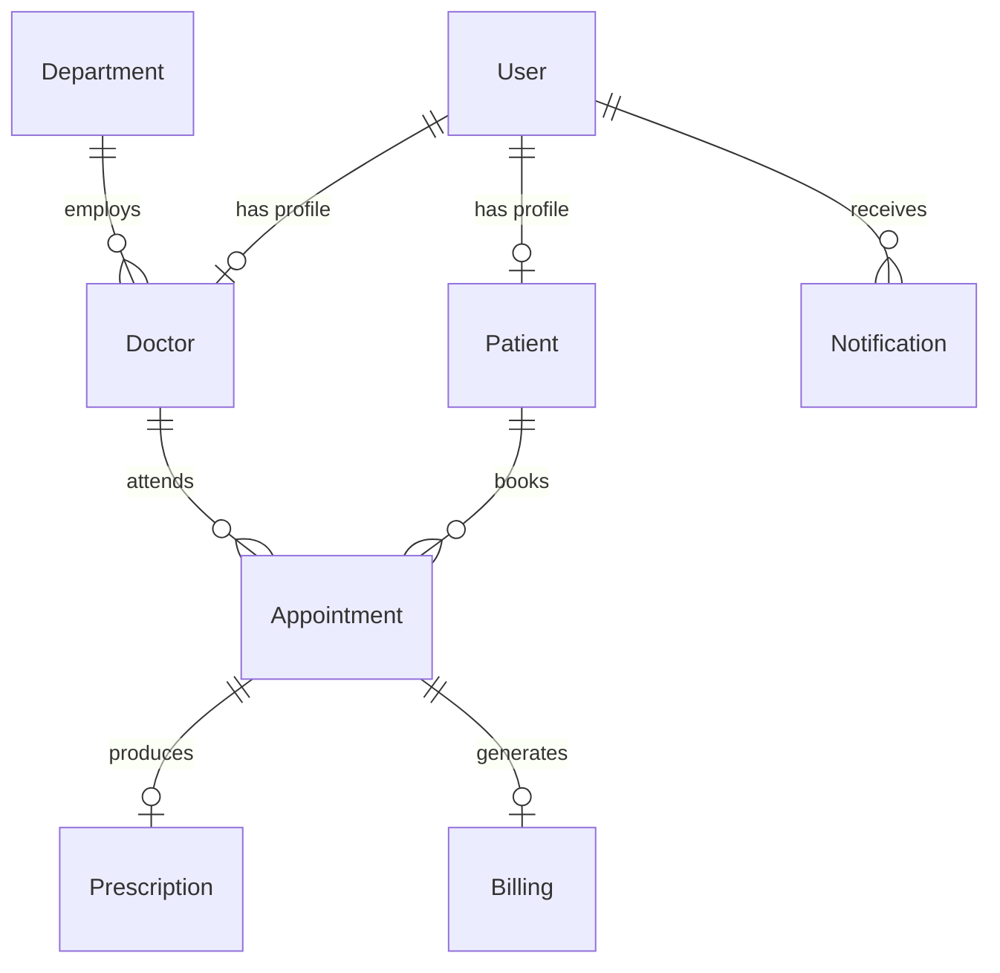

# P02 — Hospital Patient & Appointment Management System

**Christ University — 5th Semester CIA-3**  
**Course:** Advanced JavaScript Backend Frameworks  
**Technology:** Node.js, Express.js, MongoDB, Mongoose  
**Project Type:** 4-Member Group Project  
**Faculty:** L&T Faculty  
**Repository:** [https://github.com/jessesuniljs1-collab/Hospital-Patient-And-Appointment-Management-System-L-and-T-CIA-3-Group-Project.git](https://github.com/jessesuniljs1-collab/Hospital-Patient-And-Appointment-Management-System-L-and-T-CIA-3-Group-Project.git)

---

## What This Project Does

MediPulse (P02) is a healthcare backend application designed to handle patient registrations, doctor availability schedules, conflict-free appointment booking, structured visit status lifecycles, digital prescriptions, consultation billing, and hospital administrative analytics. The system secures sensitive medical data using role-based access control (RBAC) and JSON Web Tokens (JWT).

---

## Quick Start (Run in 2 Minutes)

```bash
# 1. Clone the repository
git clone https://github.com/jessesuniljs1-collab/Hospital-Patient-And-Appointment-Management-System-L-and-T-CIA-3-Group-Project.git
cd Hospital-Patient-And-Appointment-Management-System-L-and-T-CIA-3-Group-Project

# 2. Install dependencies
npm install

# 3. Create your environment file
# On Windows CMD: copy .env.example .env
# On PowerShell:  Copy-Item .env.example .env
# On Mac/Linux:   cp .env.example .env

# 4. Seed the database with demo accounts
npm run seed

# 5. Start the application
npm start
```

* **Frontend UI:** [http://localhost:5000/](http://localhost:5000/)
* **API Base:** [http://localhost:5000/api](http://localhost:5000/api)
* **Health Check:** [http://localhost:5000/api/health](http://localhost:5000/api/health)

---

## Team Members

| Member | Name | Roll No. | Section | Main Work |
|---|---|---|---|---|
| Member 1 | [NAME] | [ROLL NO.] | [SECTION] | Foundation & appointment booking |
| Member 2 | [NAME] | [ROLL NO.] | [SECTION] | Workflow, prescriptions & medical history |
| Member 3 | [NAME] | [ROLL NO.] | [SECTION] | Notifications, billing, reports & RBAC |
| Member 4 | [NAME] | [ROLL NO.] | [SECTION] | Database, Postman, documentation & PPT |

---

## Team Contributions

### What Each Team Member Worked On

* **Member 1 (Foundation / Sprint 1):**
  * Patient registration and authentication with password hashing.
  * Doctor profile and department management.
  * Doctor weekly availability time slot configuration.
  * Appointment booking engine with double-booking prevention.

* **Member 2 (Core Workflow / Sprint 2):**
  * Appointment status workflow engine (`Booked` → `Confirmed` → `Completed`).
  * Digital prescription creation linked to completed consultations.
  * Patient chronological medical history retrieval.
  * Public department and doctor specialization directory.

* **Member 3 (Reporting & Polish / Sprint 3):**
  * Event-driven in-app notifications and appointment reminders.
  * Consultation billing generation per completed visit.
  * Doctor search filtering by specialization, department, and availability.
  * Admin dashboard reports using MongoDB aggregation pipelines.
  * Role-based access control (RBAC) middleware.

* **Member 4 (Integration & Documentation):**
  * Database schema modeling, relationships, and indexing.
  * Postman collection authoring and automated testing.
  * Project documentation, user guides, and README rewrite.
  * PPT slide deck consolidation and presentation structure.

> **Note on Collaborative Development:** This project was developed collaboratively as a group project. Primary ownership was divided according to the official P02 project development structure, but all four members understand the entire codebase, business rules, and schemas for the CIA-3 viva evaluation.

---

## Why We Built It

Hospitals handle dozens of doctors across multiple medical departments with hundreds of patient visits daily. Manual front-desk coordination often leads to:
1. Long patient waiting queues and phone call bottlenecks.
2. Doctor double booking and schedule collisions.
3. Arbitrary appointment cancellations without clear records.
4. Fragmented paper prescriptions that are hard to trace.
5. Inability to track whether a patient consultation was billed.

This project solves these operational bottlenecks by providing a single, reliable backend application that enforces scheduling rules, tracks visit lifecycles deterministically, and protects patient privacy.

---

## What the Project Can Do (All 13 Modules)

1. **Patient Registration & Login:** Patients can securely create accounts, save personal health details (blood group, allergies, emergency contacts), and log in.
2. **Doctor & Department Management:** Hospital administrators can add departments (e.g. Cardiology, Neurology) and assign doctors with qualifications and fees.
3. **Doctor Availability Slots:** Doctors set their weekly consultation hours. Overlapping slots on the same day are automatically blocked.
4. **Appointment Booking Engine:** Patients book time slots that fit within the doctor's declared working hours. Colliding bookings are rejected.
5. **Appointment Status Workflow:** Appointments move step-by-step through valid stages (`Booked` → `Confirmed` → `Completed`, with `Cancelled` or `No-show` paths).
6. **Digital Prescriptions:** Doctors author structured digital prescriptions (medicines, dosage, frequency, duration, instructions) only for completed visits.
7. **Patient Medical History:** Patients can review their past consultations, prescriptions, and billing in chronological order.
8. **Department Directory:** Anyone can view hospital departments and active specialists without logging in.
9. **Notifications & Reminders:** System generates automatic in-app alerts when appointments are booked, confirmed, completed, or prescribed.
10. **Billing Summary per Visit:** When a doctor completes a visit, a consultation bill is automatically generated for tracking.
11. **Search Doctors by Specialization:** Patients can filter doctors by medical field, department name, or availability.
12. **Admin Dashboard & Reports:** Administrators view real-time MongoDB statistics on total appointments, department loads, and doctor completion rates.
13. **Role-Based Access Control (RBAC):** Three distinct roles (`Patient`, `Doctor`, `Admin`) with verified permissions on every route.

---

## How the System Works

### Main Patient & Doctor Flow

```
Patient Registers / Logs In
       ↓
Searches Doctor by Specialization
       ↓
Checks Doctor Available Slots
       ↓
Books Appointment (System validates slot & prevents double-booking)
       ↓
Doctor Confirms Appointment (Status: Confirmed)
       ↓
Doctor Completes Visit (Status: Completed)
       ↓
Doctor Issues Digital Prescription
       ↓
System Generates Consultation Billing Record
       ↓
Patient Views Medical History & Notifications
```

### Admin Flow

```
Admin Logs In
       ↓
Manages Departments & Doctor Profiles
       ↓
Oversees Walk-in Bookings & All Schedules
       ↓
Updates Consultation Payment Status (Paid / Pending)
       ↓
Reviews MongoDB Aggregation Reports (Load & Utilization)
```

---

## Technology Stack

| Technology | Version | Why We Use It |
|---|---|---|
| **Node.js** | v22.x (v18+ supported) | JavaScript runtime for running backend code outside the browser |
| **Express.js** | v4.21.0 | Fast, minimalist web framework for building REST API routes |
| **MongoDB** | Community / Atlas / Embedded | Document-oriented NoSQL database for flexible healthcare records |
| **Mongoose** | v8.6.0 | ODM library to enforce schemas, validation, and relationships |
| **JWT (jsonwebtoken)** | v9.0.2 | Generates secure tokens to authenticate user sessions |
| **bcryptjs** | v2.4.3 | Hashes passwords with 12 salt rounds before storing |
| **express-validator** | v7.2.0 | Validates incoming request parameters and body fields |
| **Jest & Supertest** | v29.7.0 & v7.0.0 | Automated integration testing for backend routes |
| **Postman** | Collection v2.1 | Manual and automated API testing with pre-scripted tokens |

---

## What You Need Before Starting

* **Node.js:** v18, v20, or v22 installed on your machine.
* **npm:** Comes with Node.js (v9 or v10).
* **Git:** For cloning the repository.
* **MongoDB:** A local MongoDB service on `localhost:27017` **OR** a free MongoDB Atlas connection string.  
  *(Note: For offline evaluation on laptops without MongoDB installed, the application includes a built-in embedded MongoDB fallback that starts automatically when no local server is found).*
* **Postman:** Optional, recommended for testing the API collection.

---

## Step-by-Step Installation

### Step 1: Clone the Repository
```bash
git clone https://github.com/jessesuniljs1-collab/Hospital-Patient-And-Appointment-Management-System-L-and-T-CIA-3-Group-Project.git
cd Hospital-Patient-And-Appointment-Management-System-L-and-T-CIA-3-Group-Project
```

### Step 2: Install Packages
```bash
npm install
```
This downloads all dependencies defined in `package.json`.

### Step 3: Set Up Your Environment File
Create `.env` using `.env.example`:

* **Windows CMD:**
  ```cmd
  copy .env.example .env
  ```
* **PowerShell:**
  ```powershell
  Copy-Item .env.example .env
  ```
* **macOS / Linux:**
  ```bash
  cp .env.example .env
  ```

### What Each Setting in `.env` Means
| Setting | Default | Purpose |
|---|---|---|
| `PORT` | `5000` | Port number the server listens on |
| `MONGO_URI` | `mongodb://localhost:27017/hospital_management` | Connection string to MongoDB |
| `JWT_SECRET` | `your_jwt_secret_key_here` | Secret key used to sign login tokens (change this for your own setup) |
| `JWT_EXPIRES_IN` | `1d` | How long login tokens remain valid (1 day) |
| `NODE_ENV` | `development` | Running mode (`development`, `production`, or `test`) |

---

## MongoDB Setup Options

### Option 1 — Local MongoDB (Standard)
1. Start your local MongoDB server (default port `27017`).
2. Keep `MONGO_URI=mongodb://localhost:27017/hospital_management` in `.env`.
3. Run `npm run seed`.

### Option 2 — MongoDB Atlas (Cloud)
1. Create a free cluster on [mongodb.com/atlas](https://www.mongodb.com/cloud/atlas).
2. Create a database username and password.
3. Under Network Access, allow access from your IP address.
4. Copy your connection string into `MONGO_URI` in `.env`.

### Option 3 — Built-in Embedded Fallback
If you are running the project on a student or faculty laptop without MongoDB installed, `config/db.js` automatically starts a local embedded MongoDB process in development mode. You do not need any external database installation for testing.

---

## Seed the Database

To fill the database with realistic sample data:
```bash
npm run seed
```

This clears old test data and creates:
* **5 Departments:** Cardiology, Neurology, Orthopedics, Pediatrics, General Medicine.
* **1 Admin:** `admin@hospital.com`
* **2 Doctors:** Dr. Rajesh Sharma (Cardiology) and Dr. Priya Patel (Neurology) with weekly schedules.
* **2 Patients:** John Doe (O+) and Sarah Smith (B+).
* **Appointments:** Sample visits across Booked, Confirmed, Completed, and Cancelled statuses.
* **Prescriptions & Billing:** Linked to the completed visit.
* **Notifications:** Sample notifications for patient and doctor.

---

## Demo Login Details

All passwords are encrypted using bcrypt:

| Role | Name | Email | Password | What You Can Test |
|---|---|---|---|---|
| **Admin** | System Admin | `admin@hospital.com` | `Admin@123` | Department CRUD, doctor creation, billing updates, reports |
| **Doctor** | Dr. Rajesh Sharma | `dr.sharma@hospital.com` | `Doctor@123` | Availability slots, confirming bookings, issuing prescriptions |
| **Doctor** | Dr. Priya Patel | `dr.patel@hospital.com` | `Doctor@123` | Neurology schedules, appointment workflow |
| **Patient** | John Doe | `patient1@example.com` | `Patient@123` | Completed visit, view prescription, view billing, own history |
| **Patient** | Sarah Smith | `patient2@example.com` | `Patient@123` | Upcoming appointment booking, notifications |

---

## Running the Application

### Production / Standard Mode
```bash
npm start
```

### Development Mode (with Live Reload)
```bash
npm run dev
```

When started, your terminal shows:
```text
🏥 Hospital Management System API
   Environment: development
   Server running on port 5000
   API Base URL: http://localhost:5000/api
   Health Check: http://localhost:5000/api/health
```

### Where to Open in Your Browser
* **Interactive Frontend:** [http://localhost:5000/](http://localhost:5000/)  
  *(Includes 1-click evaluator login buttons for all demo roles)*
* **API Health Check:** [http://localhost:5000/api/health](http://localhost:5000/api/health)
* **API Base URL:** [http://localhost:5000/api](http://localhost:5000/api)

---

## Testing the API with Postman

A complete Postman collection is located at:
`postman/P02-Hospital-System.postman_collection.json`

### Steps to Run in Postman:
1. Start the server (`npm start`).
2. Open Postman and click **Import** (top left).
3. Select `postman/P02-Hospital-System.postman_collection.json`.
4. Open folder `1. Authentication` and run **Login Admin**, **Login Doctor**, and **Login Patient 1**.
   * Postman test scripts automatically capture and store the JWT tokens into collection variables.
5. You can now execute any request across the 10 folders:
   * `1. Authentication` (Register, Login, 400 validation, 401 unauthenticated)
   * `2. Departments` (List public, Create admin, 403 forbidden)
   * `3. Doctors & Availability` (Search, Update slots, 409 Overlap test)
   * `4. Appointments` (Booking, 409 double-booking test, 400 invalid date)
   * `5. Status Workflow` (Booked → Confirmed → Completed, 400 invalid transition)
   * `6. Digital Prescriptions` (Create on completed appointment, 403 patient check)
   * `7. Medical History & Profile` (Own profile, 403 ownership check on other patient history)
   * `8. Billing` (View billing, Admin mark Paid, 403 patient update)
   * `9. Notifications` (Get alerts, mark read)
   * `10. Admin Reports` (Daily/Weekly aggregation, department load, doctor utilization)

---

## API Route Reference

### 1. Authentication (`/api/auth`)
| Method | Endpoint | Access | What it Does |
|---|---|---|---|
| `POST` | `/api/auth/register` | Public | Register new user (defaults to Patient) |
| `POST` | `/api/auth/login` | Public | Login with email and password, returns JWT |
| `GET` | `/api/auth/me` | Logged In | Get currently logged-in user profile |

### 2. Departments (`/api/departments`)
| Method | Endpoint | Access | What it Does |
|---|---|---|---|
| `GET` | `/api/departments` | Public | View all active hospital departments |
| `GET` | `/api/departments/:id` | Public | View single department details |
| `POST` | `/api/departments` | Admin | Create a new department |
| `PUT` | `/api/departments/:id` | Admin | Update department information |
| `DELETE` | `/api/departments/:id` | Admin | Soft-delete a department |

### 3. Doctors & Availability (`/api/doctors`)
| Method | Endpoint | Access | What it Does |
|---|---|---|---|
| `GET` | `/api/doctors` | Public | List and search doctors by specialization or department |
| `GET` | `/api/doctors/:id` | Public | View doctor public profile |
| `POST` | `/api/doctors` | Admin | Create doctor profile with login credentials |
| `PUT` | `/api/doctors/:id` | Doctor/Admin | Update doctor qualification, fee, or profile |
| `PUT` | `/api/doctors/:id/slots` | Doctor/Admin | Set weekly availability slots (validates non-overlapping) |
| `DELETE` | `/api/doctors/:id` | Admin | Deactivate a doctor profile |

### 4. Appointments & Workflow (`/api/appointments`)
| Method | Endpoint | Access | What it Does |
|---|---|---|---|
| `POST` | `/api/appointments` | Patient/Admin | Book consultation (validates doctor schedule & double-booking) |
| `GET` | `/api/appointments` | Logged In | List appointments filtered by caller role |
| `GET` | `/api/appointments/:id` | Logged In | View appointment details (ownership checked) |
| `PUT` | `/api/appointments/:id/status` | Logged In | Advance status (`Booked` → `Confirmed` → `Completed`) |

### 5. Digital Prescriptions (`/api/prescriptions`)
| Method | Endpoint | Access | What it Does |
|---|---|---|---|
| `POST` | `/api/prescriptions` | Doctor | Issue multi-drug prescription for a Completed visit |
| `GET` | `/api/prescriptions/:id` | Logged In | View prescription by ID |
| `GET` | `/api/prescriptions/appointment/:id` | Logged In | View prescription for a specific appointment |
| `GET` | `/api/prescriptions/patient/:id` | Logged In | View all prescriptions for a patient |

### 6. Patients & Medical History (`/api/patients`)
| Method | Endpoint | Access | What it Does |
|---|---|---|---|
| `GET` | `/api/patients/profile` | Patient | View own health profile |
| `PUT` | `/api/patients/profile` | Patient | Update own health profile and medical notes |
| `GET` | `/api/patients` | Admin | List all registered patients |
| `GET` | `/api/patients/:id/history` | Patient/Admin | View chronological visits, prescriptions, and billing |

### 7. Consultation Billing (`/api/billing`)
| Method | Endpoint | Access | What it Does |
|---|---|---|---|
| `POST` | `/api/billing` | Admin | Create manual billing record |
| `GET` | `/api/billing/:id` | Logged In | View billing record details |
| `PUT` | `/api/billing/:id` | Admin | Update payment status (`Paid` / `Pending`) |
| `GET` | `/api/billing/patient/:id` | Logged In | View all bills for a patient |

### 8. Notifications (`/api/notifications`)
| Method | Endpoint | Access | What it Does |
|---|---|---|---|
| `GET` | `/api/notifications` | Logged In | View personal alerts and unread count |
| `PUT` | `/api/notifications/:id/read` | Logged In | Mark single notification as read |
| `PUT` | `/api/notifications/read-all` | Logged In | Mark all notifications as read |

### 9. Admin Reports (`/api/admin/reports`)
| Method | Endpoint | Access | What it Does |
|---|---|---|---|
| `GET` | `/api/admin/reports/appointments` | Admin | Daily and weekly appointment volume statistics |
| `GET` | `/api/admin/reports/departments` | Admin | Department patient traffic and load counts |
| `GET` | `/api/admin/reports/doctors` | Admin | Doctor consultation completion rates |

---

## Important Business Rules

1. **Doctor Availability Overlap Prevention:**
   A doctor cannot create overlapping slots on the same day. For example, if slot 1 is `09:00 - 12:00`, trying to add `11:00 - 13:00` is rejected with `409 OVERLAPPING_SLOTS`.
2. **Double-Booking Protection:**
   Two patients cannot book overlapping times with the same doctor. If Dr. Sharma has a booking from `09:30 - 10:00`, another booking for `09:45 - 10:15` is blocked with `409 APPOINTMENT_CONFLICT`.
3. **Doctor Working Hours Enforcement:**
   Patients can only book times that fall completely within the doctor's declared schedule.
4. **Appointment Status State Machine:**
   Appointments must follow valid steps:
   * `Booked` → `Confirmed` (by Doctor or Admin)
   * `Confirmed` → `Completed` (by Doctor or Admin)
   * `Booked` or `Confirmed` → `Cancelled` (by Patient, Doctor, or Admin)
   * `Confirmed` → `No-show` (by Doctor or Admin)
   * Random or backward jumps (e.g. `Completed` → `Booked`) are rejected with `400 INVALID_STATUS_TRANSITION`.
5. **Prescription Restrictions:**
   A doctor can only issue a digital prescription for visits that have status `Completed`. Doctors cannot prescribe for patients they did not consult. Duplicate prescriptions for the same appointment are blocked (`409`).
6. **Medical History Privacy:**
   A patient can only view their own medical history. Attempting to view another patient's records is blocked with `403 OWNERSHIP_VIOLATION`.
7. **Automated Billing Generation:**
   When an appointment is marked `Completed`, the system automatically generates a consultation bill (`paymentStatus: Pending`) with the doctor's fee. Only Admins can mark it `Paid`.

---

## Database Collections & Relationships



### Main Collections:
* `users` — Login email, hashed password, role (`Patient`, `Doctor`, `Admin`), phone number, and active state.
* `patients` — Date of birth, gender, blood group, medical allergies, address, emergency contact, linked to `users`.
* `doctors` — Department, specialization, experience, consultation fee, and embedded weekly availability slots.
* `departments` — Department names (e.g. Cardiology) and descriptions.
* `appointments` — Patient ID, Doctor ID, appointment date, start/end slot, reason, and status (`Booked`, `Confirmed`, `Completed`, `Cancelled`, `No-show`).
* `prescriptions` — Linked to appointment, contains diagnosis, medicines list (name, dosage, frequency, duration, instructions), and doctor notes.
* `billing` — Linked to appointment, amount, payment status (`Pending`, `Paid`), and payment method.
* `notifications` — Alerts for booking, confirmation, prescriptions, and status updates.

---

## Project Structure

```text
Hospital-Patient-And-Appointment-Management-System-L-and-T-CIA-3-Group-Project/
├── config/
│   ├── db.js                     # MongoDB connection with embedded fallback
│   └── env.js                    # Centralized environment variable management
├── models/
│   ├── User.js                   # Base user and authentication model
│   ├── Patient.js                # Patient health profile model
│   ├── Doctor.js                 # Doctor profile and availability slots model
│   ├── Department.js             # Hospital department model
│   ├── Appointment.js            # Appointment schedule and status model
│   ├── Prescription.js           # Multi-drug digital prescription model
│   ├── Billing.js                # Consultation billing model
│   └── Notification.js           # Event notification model
├── controllers/
│   ├── authController.js         # Register, Login, GetMe
│   ├── departmentController.js   # Department CRUD operations
│   ├── doctorController.js       # Doctor profiles, search, availability slots
│   ├── appointmentController.js  # Booking engine, conflict detection, workflow
│   ├── prescriptionController.js # Prescription generation & retrieval
│   ├── patientController.js      # Patient profile & chronological medical history
│   ├── billingController.js      # Billing generation & payment status updates
│   ├── notificationController.js # Notifications retrieval & read markers
│   └── reportController.js       # MongoDB aggregation reports (Admin)
├── routes/
│   ├── authRoutes.js             # /api/auth
│   ├── departmentRoutes.js       # /api/departments
│   ├── doctorRoutes.js           # /api/doctors
│   ├── appointmentRoutes.js      # /api/appointments
│   ├── prescriptionRoutes.js     # /api/prescriptions
│   ├── patientRoutes.js          # /api/patients
│   ├── billingRoutes.js          # /api/billing
│   ├── notificationRoutes.js     # /api/notifications
│   └── reportRoutes.js           # /api/admin/reports
├── middleware/
│   ├── auth.js                   # JWT token authentication
│   ├── authorize.js              # Role authorization & patient ownership checks
│   ├── validate.js               # express-validator result handler
│   └── errorHandler.js           # Centralized error handler & AppError class
├── validators/
│   ├── authValidator.js          # Registration and login validation schemas
│   ├── departmentValidator.js    # Department validation schemas
│   ├── doctorValidator.js        # Doctor create and availability validation schemas
│   ├── appointmentValidator.js   # Appointment slot and query schemas
│   ├── prescriptionValidator.js  # Prescription medicines validation schemas
│   ├── billingValidator.js       # Billing update validation schemas
│   └── patientValidator.js       # Profile update validation schemas
├── services/
│   └── notificationService.js    # Decoupled notification generator
├── seed/
│   ├── seed.js                   # Database seed script
│   └── seedHelper.js             # Reusable seeding logic
├── scripts/
│   └── verify-api.js             # Live 20-point API verification test
├── tests/
│   └── api.test.js               # 40 automated Jest integration tests
├── postman/
│   └── P02-Hospital-System.postman_collection.json # Exported Postman collection
├── public/                       # Frontend Single-Page Application
│   ├── index.html                # UI with 1-click evaluator login
│   ├── style.css                 # Custom healthcare design system
│   └── app.js                    # Live API client logic
├── .env.example                  # Environment configuration template
├── .gitignore                    # Excludes .env, node_modules/, coverage/, logs/
├── package.json                  # Scripts and dependencies
├── package-lock.json             # Deterministic dependency lockfile
├── README.md                     # This documentation guide
└── server.js                     # Express application entrypoint
```

---

## Automated Testing

### 1. Integration Tests (`npm test`)
Run the automated test suite using Jest and Supertest:
```bash
npm test
```
* **Coverage:** 40 integration tests covering all 13 modules.
* **Checks:** Validation errors (400), duplicate email checks (409), JWT verification (401), role permissions (403), schedule collisions (409), status transitions, prescription rules, patient ownership, billing, and reports.
* **Result:** **40 passed, 0 failed (100% pass rate)**.

### 2. Live Server Verification (`npm run verify`)
While the server is running (`npm start`), open a second terminal and run:
```bash
npm run verify
```
This performs 20 end-to-end HTTP requests against `http://localhost:5000/api` verifying real responses for registration, login, bookings, conflict rejection, state transitions, prescriptions, medical history, billing, and reports.
* **Result:** **20 passed, 0 failed (100% pass rate)**.

---

## Troubleshooting Guide

| Problem | Cause | Solution |
|---|---|---|
| `MongoDB Connection Error` | Local MongoDB is not running | Start your local MongoDB service, use MongoDB Atlas, or let the built-in embedded fallback start automatically in development mode. |
| `EADDRINUSE: port 5000 busy` | Another app is using port 5000 | Change `PORT=5001` in your `.env` file. |
| `401 Unauthorized` | Missing or expired login token | Log in again using `POST /api/auth/login` to get a fresh JWT token. |
| `403 Forbidden` | Your account does not have permission | Ensure you are logged in with the correct role (e.g. only Admins can create departments or view reports). |
| `403 Ownership Violation` | Patient trying to view another patient's medical records | Patients can only request their own medical history. |
| `409 Conflict (Appointment)` | Double-booking attempt | Pick a time slot where the doctor does not already have an active appointment. |
| `409 Conflict (Slots)` | Doctor availability slots overlap | Make sure each availability slot on a given day has separate start and end times. |
| `400 Invalid Status Transition` | Illegal status change (e.g. `Completed` → `Booked`) | Status changes must follow: `Booked` → `Confirmed` → `Completed`. |
| Database has no data | Fresh database has not been seeded | Run `npm run seed` to populate demo records. |

---

## Suggested Faculty Demo Flow

1. **Login as Admin:** Click the **🔑 Admin** button on top (`admin@hospital.com` / `Admin@123`).
2. **View Departments:** Click the **Departments** tab to see the 5 active hospital departments.
3. **View Doctors:** Click the **Doctors** tab; search `Cardiology` to see Dr. Rajesh Sharma and his weekly availability slots.
4. **Login as Patient:** Click the **🧑 John Doe (Patient 1)** button (`patient1@example.com` / `Patient@123`).
5. **Book an Appointment:** Click **+ Book New Appointment**, choose Dr. Sharma, select an upcoming Monday at `09:30 - 10:00`, and submit.
6. **Show Double-Booking Protection:** Try to book the overlapping time `09:45 - 10:15` with Patient 2; observe the immediate `409 APPOINTMENT_CONFLICT` rejection alert.
7. **Login as Doctor:** Click the **🩺 Dr. Sharma** button (`dr.sharma@hospital.com` / `Doctor@123`) and open **Doctor Desk**.
8. **Confirm Booking:** Click **Confirm Booking** on the newly scheduled appointment. Status becomes `Confirmed`.
9. **Complete Consultation:** Click **Mark Completed** after the visit. Status becomes `Completed`.
10. **Issue Prescription:** Click **Issue Prescription**, add medication (e.g. Metoprolol, 25mg, Daily for 14 days), and submit.
11. **View Medical History:** Log back in as **Patient 1**; open **Medical History** to see the completed visit, digital prescription, and auto-generated billing record.
12. **Show Ownership Protection:** Try accessing Patient 1's history with Patient 2's token via API; observe the `403 OWNERSHIP_VIOLATION` block.
13. **Admin Reports:** Log back in as **Admin**; open **Admin & Reports** to view real-time MongoDB aggregation metrics for total visits, department loads, and doctor utilization rates.

---

## Academic Context

This project was developed as a four-member group project for the 5th Semester CIA-3 assessment at Christ University under the Advanced JavaScript Backend Frameworks course taught by L&T faculty.

The repository contains the complete working backend application, MongoDB/Mongoose models, authentication, business rule engines, single-page frontend, automated integration tests, seed data, Postman collection, and documentation.
